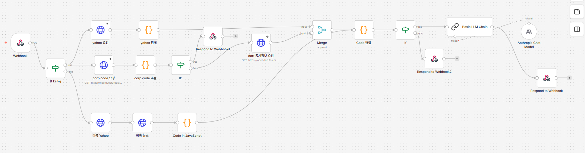

# StockLens — n8n 워크플로우 ⚙️

[](https://n8n.io/)
[](https://www.docker.com/)
[](https://render.com/)

<br />

**StockLens** 의 데이터 수집 및 AI 분석 워크플로우입니다.  
Yahoo Finance, DART API에서 데이터를 수집하고 Claude AI로 리서치 리포트를 생성합니다.

**🔗 [프론트엔드 저장소](https://github.com/ahyeona/stocklens-frontend)**

<br />

## 🔄 워크플로우 구조

```
Webhook (POST /webhook/stock-report)
     │
     ▼
IF (국내 .KS/.KQ | 미국)
     │
     ├── 국내 주식
     │     ├── Supabase API → corp_code 조회
     │     │     └── IF (에러) → 에러 응답
     │     │
     │     ├── DART API → 최근 30일 공시 수집  ─┐
     │     └── Yahoo Finance → 최근 주가 수집  ──┤
     │                                          Merge
     │                                           │
     │                                      Code (데이터 병합)
     │                                           │
     └── 미국 주식                           IF (에러?)
           ├── Yahoo Finance → 주가 수집         │
           └── Yahoo Finance → 뉴스 수집    Claude AI
                     │                          │
                Code (데이터 정제)         Respond to Webhook
                     │
                Code (데이터 병합) ──────────────┘
```



<br />

## 🛠 기술 스택

- **n8n** — 워크플로우 자동화
- **Claude claude-haiku-4-5** — AI 리포트 생성
- **Yahoo Finance API** — 주가/뉴스 데이터
- **DART API** — 국내 기업 공시 데이터
- **Supabase REST API** — corp_code 매핑 조회
- **Docker** — 로컬 실행 환경
- **Render** — 클라우드 배포

<br />

## 📡 API 명세

### 요청

```
POST /webhook/stock-report
Content-Type: application/json

{
  "ticker": "005930.KS"   // 국내: 종목코드.KS / 미국: AAPL
}
```

### 성공 응답

```json
{
  "success": true,
  "report": "# 삼성전자 분석 리포트\n\n## 1. 최근 주가 흐름..."
}
```

### 실패 응답

```json
{
  "success": false,
  "error": "005930에 해당하는 종목을 찾을 수 없습니다."
}
```

<br />

## 🔥 기술적 도전 및 해결

### 1. DART corp_code 매핑

DART API는 `stock_code`로 `corp_code`를 직접 조회하는 엔드포인트가 없습니다.  
→ DART 전체 기업 목록 ZIP 파일을 파싱하여 약 2,800개 상장 종목의 매핑 테이블을 생성하고 Supabase에 저장했습니다.

### 2. 병렬 데이터 수집

→ n8n의 분기 연결과 Merge 노드를 활용하여 DART와 Yahoo Finance를 동시에 호출하는 파이프라인을 구성했습니다.

### 3. 국내/미국 분기 처리

→ IF 노드로 티커 형식(.KS/.KQ 포함 여부)을 감지하여 각각 다른 파이프라인을 실행합니다. 미국 주식은 DART 대신 Yahoo Finance 뉴스 API를 사용합니다.

<br />


## ⚙️ 환경변수

| 변수                           | 설명                                                     |
| ------------------------------ | -------------------------------------------------------- |
| `DART_API_KEY`                 | DART 오픈API 인증키 ([발급](https://opendart.fss.or.kr)) |
| `SUPABASE_URL`                 | Supabase 프로젝트 URL                                    |
| `SUPABASE_ANON_KEY`            | Supabase anon public 키                                  |
| `N8N_BLOCK_ENV_ACCESS_IN_NODE` | Code 노드 환경변수 접근 허용 (`false`)                   |

<br />

## 📦 외부 서비스

| 서비스                                         | 용도                  | 비용        |
| ---------------------------------------------- | --------------------- | ----------- |
| [Anthropic API](https://console.anthropic.com) | Claude AI 리포트 생성 | 유료 (소량) |
| [DART API](https://opendart.fss.or.kr)         | 국내 기업 공시 조회   | 무료        |
| [Yahoo Finance](https://finance.yahoo.com)     | 주가/뉴스 데이터      | 무료        |
| [Supabase](https://supabase.com)               | corp_code 매핑 DB     | 무료        |
